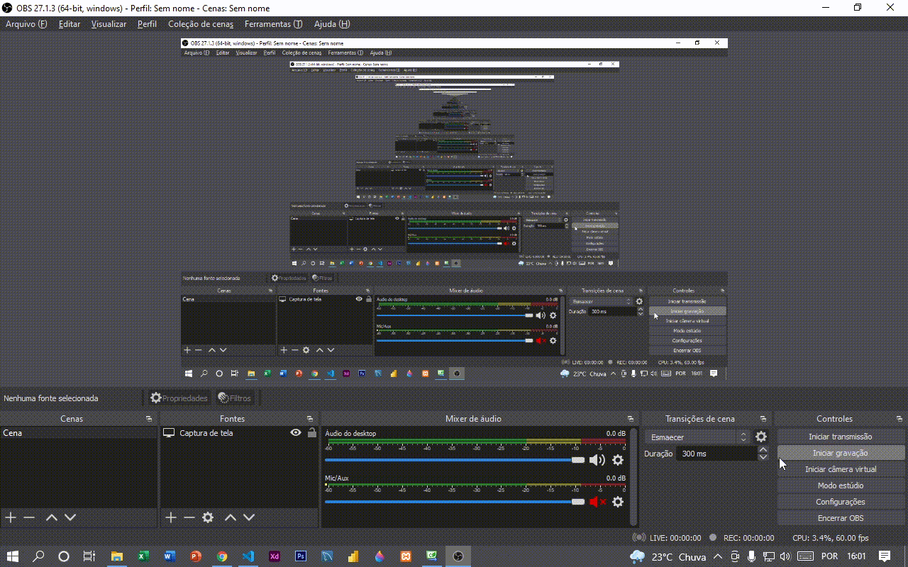

# Calculador de reajuste salarial

Programa simples para calcular o lucro sobre o salário de um funcionário de acordo com o valor(%) do reajuste inserido.
**Observação:** Por se tratar de um programa simples apenas para aprendizado, não é possível digitar o símbolo de % no campo do valor de reajuste.

## Resultado

